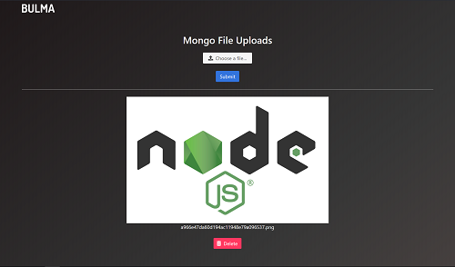

# Simple App to Upload Files to MongoDB
This project is the result of my code-along to the Node Upload App: [Uploading Files to MongoDB With GridFS (Node.js App)](https://www.youtube.com/watch?v=3f5Q9wDePzY) by *Brad Traversy*.  The app uses [Multer's GridFS Storage Engine](https://github.com/devconcept/multer-gridfs-storage) to store uploaded files directly to MongoDB and [GridFS Stream](https://canvasjs.com/) for file streams.  The front-end of this app was styled using the [Bulma CSS Framework](https://bulma.io) instead of Bootstrap, which was used in the original video.

   

## Versions
* Mongoose v5.0.9 (MongoDB v3.6)
* Express v4.16.2
* Node v9.7.1
* [Bulma](https://bulma.io) v0.6.2

## Installation
1. Clone this repo `git clone https://github.com/stanleyeosakul/node-gridfs.git`
1. `cd` into the folder of the cloned repo
1. Run `yarn install` to install dependencies
1. Start your local MongoDB instance
1. Run `npm start`, and navigate to `http://localhost:3000/`